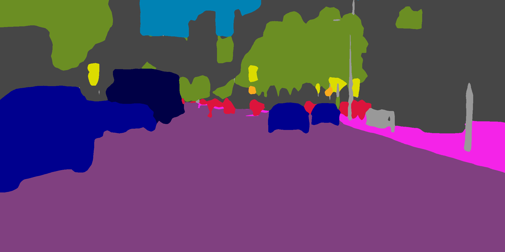
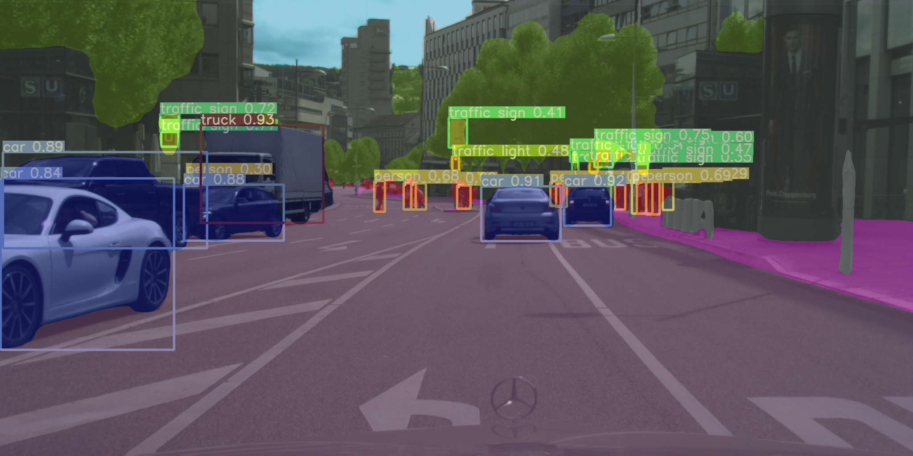

# Multi-Function Detection and Segmentation System

[中文版介绍]()

## Overview

**This project is my undergraduate graduation project.**

Its main function is target detection through YOLOv5 and semantic segmentation with PSPNet.

The codes of YOLOv5 part of this project are based on
the *[ultralytics YOLO V5 tag v5.0](https://github.com/ultralytics/yolov5)* , and I do the target detection by the
source code .
Correspondingly, I also used the YOLOv5 pre-training models provided by ultralytics.I'd like to express my gratitude to
him!
I usually use the two simplest pre-training models--yolov5s.pt and yolov5s.pt. You can directly see them in ./weights.

In the part of semantic segmentation, I use this PSPNet which full name
is *[Pyramid Scene Parsing Network](https://arxiv.org/abs/1612.01105)*, this network model was proposed on CVPR in 2017.
In my part, it's one of the best networks between performance and brevity.
In the truth, after I pull the YOLOv5 codes, I just spent a little time finishing the main part, and I spent most of the
rest of the time combining this module with YOLO.

## Demo

### The three images are a group of classic processing result.

## Files&Folders

### ./weights

The folder contains four pre-training files."yolov5s.pt" and "yolov5m.pt" are target detection models, "pspv5s.pt" and "
pspv5m.pt" are the segmentation models. They all have good performance, They all have good performance, but the
segmentation models still have some disadvantages because of the lack of performance of my graphics card.

It should be pointed out that the performance of "XX5m.pt" is better than "XX5s.pt" because its network is more complex.

### ./runs

This folder contains the results of the project detect, test or training.

### ./demo_image

This folder contains some demo images

### ./data

This folder contains all datasets. I mainly train my segmentation model by the CityScapes dataset and use the
pre-training model in the part of target detection. Certainly, if you want to train the YOLOv5 model, you'll use the
Microsoft CoCo dataset.

### ./models

This folder is the most important for me.

In the common.py, I mainly add three modules, the RFB2 and FFM play an auxiliary role, and the PyramidPooling module
plays a segmentation role and this is completely modeled on the model
of *[the PSPNet paper](https://arxiv.org/abs/1612.01105)*. Certainly, there are many modules which come from
ultralytics/YOLOv5, and I delete all of unused module.

In the yolo.py, I add a class named SegMaskPSP, which integrates the three modules which are mentioned in the common.py,
and when training the model, the parse_model function will call it.

### train.py

The python file is roughly the same as the train.py in ultralytics/YOLOv5. I made some changes to the YOLOv5 project
when I studied it. It looks very different, but the main structure has not changed.
You can use the cmd code

`python train.py --data cityscapes_det.yaml --cfg yolov5s_city_seg.yaml --batch-size 18 --epochs 200 --weights ./yolov5s.pt --workers 8 --label-smoothing 0.1 --img-size 832 --noautoanchor`

to train your own model. Certainly, if the performance of your graphics card isn't very high, you can try to reduce the
number of workers and batch-size. Certainly, I advise you to directly use my pre-training models or go to some could GPU
platforms if you're not short of money. (In the truth, I have been to a website named autoDL many times. )

### test.py

The python file is to test the performance of your model by some famous indicators such as Prediction,Recall,F1 and so
on.
You can use the cmd code
`python test.py --data data/cityscapes_det.yaml --segdata ./data/citys --weights weights/pspv5m.pt --img-size 1024 --base-size 1024`
to test your model.

### detect.py

The model may be the most important to you if you only want to use my project directly.
In the file, you can choose three modes: ① image detection, ② video detection and ③ camera live detection

### predict.py

The python file is to call detect.py .

**Other Folders or Files are from ultralytics/YOLOv5 and basically don't matter.** 

### requirements.txt
You can use `pip install -r requirements.txt` to install all needed packages. And if you use the Windows System, you should replace 'pycocotools' to 'pycocotools-windows' in the txt file.

Certainly, I guess that you'll encounter some errors when installing them. I advise you to use conda to create a new python virtual environment.
When you have installed Anaconda, you can start "Anaconda powershell prompt" .
The code creating virtual environment is `conda create -n your_env_name python=x.x`
and you can use `conda install -n your_env_name package_name` to install other packages.